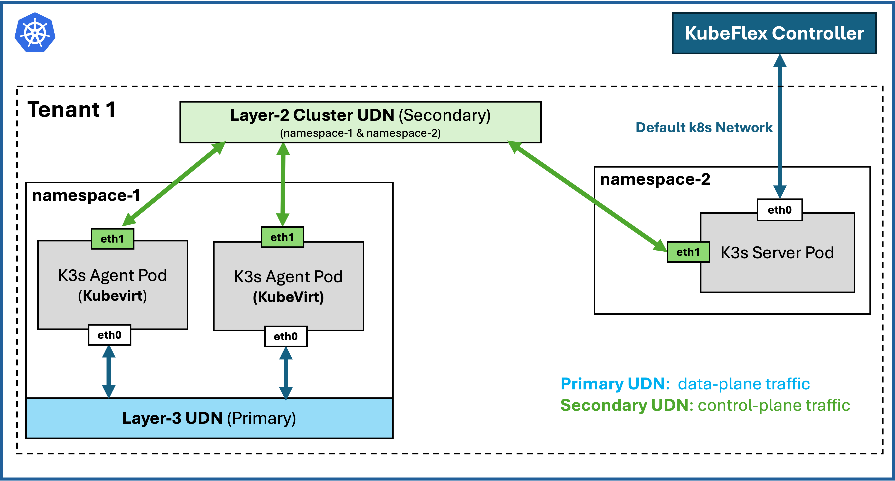

# Three Shades of Isolation: A Multi-tenancy Fortress

This guide demonstrates how to build a multi-tenant Kubernetes environment with complete isolation at the control plane, data plane, and network layer using User-Defined Networks (UDNs), KubeFlex, and KubeVirt.



## Overview

This is a **simple demonstration** running on a **KIND (Kubernetes in Docker) cluster** that showcases the three shades of isolation for multi-tenancy using **two tenants** (tenant-1 and tenant-2) as a use case. Each tenant runs an **nginx workload** to demonstrate complete isolation across:

- **Network Layer**: Isolated User-Defined Networks (UDNs) with separate routing tables
- **Control Plane Layer**: Dedicated K3s control planes per tenant using KubeFlex
- **Compute Layer**: Isolated worker VMs running in KubeVirt

Both tenants are completely isolated from each other while running on the same underlying KIND cluster, proving that true multi-tenancy can be achieved with the right combination of technologies.

## Table of Contents

1. [Requirements](#requirements)
2. [Create a KIND Cluster with UDN CNI](#1-create-a-kind-cluster-with-udn-cni)
3. [Build the Image for Fedora and Launch KIND](#2-build-the-image-for-fedora-and-launch-the-kind-deployment)
4. [Deploy KubeVirt](#3-deploy-kubevirt)
5. [Deploy KubeFlex](#4-deploy-kubeflex)
6. [Create UDNs for Tenants](#5-create-udns-for-tenant-1--tenant-2)
7. [Create K3s Control Planes](#6-create-k3s-control-plane-for-tenant-1--tenant-2)
8. [Create UDN EgressIP](#7-create-udn-egressip-for-egress-connectivity)
9. [Create VMs and Attach to K3s](#8-create-vms-and-attach-to-k3s-control-planes)
10. [Create Proxy Pods](#9-create-proxy-pods-for-ingress-connectivity)
11. [Deploy Workloads](#10-deploy-the-workloads)
12. [Test the Setup](#11-send-requests-to-tenant-1--tenant-2)

## Requirements

### System Requirements
- **OS**: Linux (Ubuntu 20.04+ or similar)
- **CPU**: 8+ cores recommended
- **RAM**: 64GB+ recommended
- **Disk**: 100GB+ free space

### Required Tools

| Tool | Version | Installation | Purpose |
|------|---------|--------------|---------|
| **Docker** | 20.10+ | [Install Docker](https://docs.docker.com/engine/install/) | Container runtime for KIND |
| **kubectl** | 1.28+ | [Install kubectl](https://kubernetes.io/docs/tasks/tools/) | Kubernetes CLI |
| **KIND** | 0.20+ | [Install KIND](https://kind.sigs.k8s.io/docs/user/quick-start/#installation) | Local Kubernetes cluster |
| **Helm** | 3.12+ | [Install Helm](https://helm.sh/docs/intro/install/) | Package manager for Kubernetes |
| **jq** | 1.6+ | `sudo apt install jq` (Ubuntu) | JSON processor |
| **virtctl** | Latest | See below | KubeVirt CLI |

### Install virtctl (KubeVirt CLI)

```bash
# Install krew (kubectl plugin manager)
(
  set -x; cd "$(mktemp -d)" &&
  OS="$(uname | tr '[:upper:]' '[:lower:]')" &&
  ARCH="$(uname -m | sed -e 's/x86_64/amd64/' -e 's/\(arm\)\(64\)\?.*/\1\2/' -e 's/aarch64$/arm64/')" &&
  KREW="krew-${OS}_${ARCH}" &&
  curl -fsSLO "https://github.com/kubernetes-sigs/krew/releases/latest/download/${KREW}.tar.gz" &&
  tar zxvf "${KREW}.tar.gz" &&
  ./"${KREW}" install krew
)

# Add krew to PATH
export PATH="${KREW_ROOT:-$HOME/.krew}/bin:$PATH"
echo 'export PATH="${KREW_ROOT:-$HOME/.krew}/bin:$PATH"' >> ~/.bashrc

# Install virtctl
kubectl krew install virt
```


### ⚠️ Critical Requirement: VRF Kernel Module

**1. Check if VRF module is available:**

```bash
# Check if VRF module exists
modinfo vrf

# Check if VRF is currently loaded
lsmod | grep vrf
```

**2. Install VRF module (if not available):**

For **Ubuntu/Debian**:
```bash
# Install linux-modules-extra package
sudo apt update
sudo apt install linux-modules-extra-$(uname -r)
```

For **Amazon Linux 2/RHEL/CentOS**:
```bash
# VRF is usually included in the kernel-modules package
sudo yum install kernel-modules-$(uname -r)
```

**3. Load the VRF module:**

```bash
# Load VRF module
sudo modprobe vrf

# Verify it's loaded
lsmod | grep vrf
```

Expected similar output:
```console
vrf                    28672  0
```


**4. Verify VRF is working:**

```bash
# Check VRF capabilities
ip link help 2>&1 | grep vrf

# Should show VRF-related options
```

**Why is this important?**
- Layer3 UDNs require VRF for isolated routing tables
- EgressIP functionality depends on VRF
- Without VRF, pods in UDNs cannot reach external networks
- The KIND cluster will fail to initialize Layer3 network features

---

## 1. Create a KIND Cluster with UDN CNI


```bash
git clone https://github.com/ovn-kubernetes/ovn-kubernetes.git
cd ovn-kubernetes
```

## 2. Build the Image for Fedora and Launch the KIND Deployment

Pull and tag pre-built image: 
```bash
docker pull ghcr.io/ovn-org/ovn-kubernetes/ovn-kube-fedora:master
docker tag ghcr.io/ovn-org/ovn-kubernetes/ovn-kube-fedora:master ovn-daemonset-fedora
```

Continue with KIND deployment: 
```bash
pushd contrib
export KUBECONFIG=${HOME}/ovn.conf
./kind.sh -mne -nse
popd
```

Check the Components:

```bash
kubectl -n ovn-kubernetes get pods
```

Expected similar output:
```console
NAME                                    READY   STATUS    RESTARTS       AGE
ovnkube-control-plane-5b955978b-t922v   1/1     Running   1 (114s ago)   2m6s
ovnkube-identity-r225g                  1/1     Running   0              2m7s
ovnkube-node-nm5p5                      6/6     Running   0              2m5s
ovnkube-node-wm9rj                      6/6     Running   0              2m5s
ovnkube-node-x8cmc                      6/6     Running   0              2m5s
ovs-node-2mhjv                          1/1     Running   0              2m8s
ovs-node-2z99g                          1/1     Running   0              2m8s
ovs-node-7p7fz                          1/1     Running   0              2m8s
```

## 3. Deploy KubeVirt

```bash
export VERSION=$(curl -s https://storage.googleapis.com/kubevirt-prow/release/kubevirt/kubevirt/stable.txt)

echo $VERSION
kubectl create -f "https://github.com/kubevirt/kubevirt/releases/download/${VERSION}/kubevirt-operator.yaml"
```

Deploy the KubeVirt Custom Resource Definitions:

```bash
kubectl create -f "https://github.com/kubevirt/kubevirt/releases/download/${VERSION}/kubevirt-cr.yaml"
```

Enable KubeVirt Emulation:

```bash
kubectl -n kubevirt patch kubevirt kubevirt --type=merge --patch '{"spec":{"configuration":{"developerConfiguration":{"useEmulation":true}}}}'
```

Check the Components:

```bash
kubectl -n kubevirt get pods
```

Expected similar output:
```console
NAME                               READY   STATUS    RESTARTS   AGE
virt-api-9d99b8957-46tkc           1/1     Running   0          2m47s
virt-api-9d99b8957-g7kwr           1/1     Running   0          85s
virt-controller-569dcc495f-hgw5l   1/1     Running   0          2m21s
virt-controller-569dcc495f-vslnh   1/1     Running   0          2m21s
virt-handler-78nhb                 1/1     Running   0          2m21s
virt-handler-j5sbd                 1/1     Running   0          2m21s
virt-handler-jlk74                 1/1     Running   0          2m21s
virt-operator-7c4dc9d77f-4m7dm     1/1     Running   0          3m22s
virt-operator-7c4dc9d77f-jzrh2     1/1     Running   0          3m22s
```

## 4. Deploy KubeFlex

Install CLI:

```bash
sudo su <<EOF
bash <(curl -s https://raw.githubusercontent.com/kubestellar/kubeflex/main/scripts/install-kubeflex.sh) --ensure-folder /usr/local/bin --strip-bin
EOF
```

Deploy KubeFlex Controller:

```bash
kubectl create ns kubeflex-system
helm upgrade --install kubeflex-operator oci://ghcr.io/kubestellar/kubeflex/chart/kubeflex-operator \
  --version v0.9.3 \
  --namespace kubeflex-system \
  --set domain=localtest.me \
  --set externalPort=9443
```

Check the Components:

```bash
kubectl -n kubeflex-system get pods
```

Expected similar output:
```console
NAME                                           READY   STATUS      RESTARTS   AGE
kubeflex-controller-manager-6fdf485568-xzp2t   2/2     Running     0          2m3s
kubeflex-operator-g76mk                        0/1     Completed   0          2m3s
postgres-postgresql-0                          1/1     Running     0          109s
```

## 5. Create UDNs for Tenant-1 & Tenant-2

Create UDNs for both tenants:

```bash
kubectl create -f tenant-1/udn-tenant-1.yaml
kubectl create -f tenant-2/udn-tenant-2.yaml
```

Check the Components:

```bash
kubectl get udn,cudn -A
```

Expected output:
```console
NAMESPACE   NAME                                         AGE
tenant-1    userdefinednetwork.k8s.ovn.org/tenant-1-dp   3m36s
tenant-2    userdefinednetwork.k8s.ovn.org/tenant-2-dp   3m30s

NAMESPACE   NAME                                                      AGE
            clusteruserdefinednetwork.k8s.ovn.org/tenant-1-cp         3m36s
            clusteruserdefinednetwork.k8s.ovn.org/tenant-1-external   3m36s
            clusteruserdefinednetwork.k8s.ovn.org/tenant-2-cp         3m30s
            clusteruserdefinednetwork.k8s.ovn.org/tenant-2-external   3m30s
```

Verify if the UDNs are successfully created:

```bash
# Test tenant-1
kubectl get cudn tenant-1-cp -o jsonpath='{.status.conditions}' | jq
```

Expected similar output:

```console
[
  {
    "lastTransitionTime": "2026-04-13T18:59:58Z",
    "message": "NetworkAttachmentDefinition has been created in following namespaces: [tenant-1]",
    "reason": "NetworkAttachmentDefinitionCreated",
    "status": "True",
    "type": "NetworkCreated"
  }
]
```


## 6. Create K3s Control Plane for Tenant-1 & Tenant-2

Create control planes for both tenants:

```bash
for TENANT in tenant-1 tenant-2; do
  kflex create ${TENANT}-cp --type k3s --kubeconfig=/root/ovn.conf
done
```

Check the Components:

```bash
kubectl config get-contexts
```

Expected similar output:
```console
CURRENT   NAME          CLUSTER               AUTHINFO            NAMESPACE
          kind-ovn      kind-ovn              kind-ovn
          tenant-1-cp   tenant-1-cp-cluster   tenant-1-cp-admin
*         tenant-2-cp   tenant-2-cp-cluster   tenant-2-cp-admin
```

```bash
kubectl config use-context kind-ovn
kubectl -n tenant-1-cp-system get pods
kubectl -n tenant-2-cp-system get pods
```

Expected similar output for each tenant:
```console
NAME                             READY   STATUS      RESTARTS   AGE
k3s-bootstrap-kubeconfig-pfm2r   0/2     Completed   4          92s
k3s-server-0                     1/1     Running     0          92s
```

Patch the K3s StatefulSets for UDN Configurations:

1. Apply the Patch for both tenants:

```bash
kubectl -n tenant-1-cp-system patch statefulset k3s-server --type=strategic --patch-file tenant-1/tenant-1-k3s-patch.yaml
kubectl -n tenant-2-cp-system patch statefulset k3s-server --type=strategic --patch-file tenant-2/tenant-2-k3s-patch.yaml
```

2. Verify the Patches:

Check if patches were applied and the k3s control pods have joined their UDN control plane networks:
```bash
for TENANT in tenant-1 tenant-2; do
  echo "=== ${TENANT} ==="
  kubectl -n ${TENANT}-cp-system get pod k3s-server-0 -o jsonpath='{.metadata.annotations.k8s\.v1\.cni\.cncf\.io/network-status}' | jq
done
```

Expected similar output for each tenant:
```console
[
  {
    "name": "ovn-kubernetes",
    "interface": "eth0",
    "ips": [
      "10.244.2.11"
    ],
    "mac": "0a:58:0a:f4:02:0b",
    "default": true,
    "dns": {}
  },
  {
    "name": "tenant-1-cp-system/tenant-1-cp",
    "interface": "net1",
    "ips": [
      "104.104.0.3"
    ],
    "mac": "0a:58:68:68:00:03",
    "dns": {}
  }
]
```


Verify control-plane node for both tenants:
```bash
for TENANT in tenant-1 tenant-2; do
  echo "=== ${TENANT} nodes ==="
  kubectl -n ${TENANT}-cp-system exec k3s-server-0 -- kubectl get nodes -o wide
done
```

Expected similar output for each tenant:
```console
NAME           STATUS   ROLES                  AGE   VERSION         INTERNAL-IP   EXTERNAL-IP   OS-IMAGE            KERNEL-VERSION    CONTAINER-RUNTIME
k3s-server-0   Ready    control-plane,master   26m   v1.30.13+k3s1   104.104.0.2   104.104.0.2   K3s v1.30.13+k3s1   6.14.0-1011-aws   containerd://1.7.27-k3s1
```

## 7. Create UDN EgressIP for Egress connectivity:

#### a) Label worker nodes to allow EgressIP assignment

Before creating EgressIP resources, you must label the worker nodes that are eligible to host EgressIPs:

```bash
kubectl label nodes ovn-worker k8s.ovn.org/egress-assignable=""
kubectl label nodes ovn-worker2 k8s.ovn.org/egress-assignable=""
```

#### b) Create EgressIP resources for both tenants

```bash
for TENANT in tenant-1 tenant-2; do
  ./create-egressip.sh ${TENANT}
done
```

#### c) Verify EgressIP assignment

Check if the egressIPs were created and assigned successfully:

```bash
kubectl get egressip
```

Expected output:
```console
NAME              EGRESSIPS    ASSIGNED NODE   ASSIGNED EGRESSIPS
tenant-1-egress   172.19.0.5   ovn-worker2     172.19.0.5
tenant-2-egress   172.19.0.6   ovn-worker      172.19.0.6
```

**Note:** The `ASSIGNED NODE` column should show one of the worker nodes (`ovn-worker` or `ovn-worker2`). If it's empty, check that the node labels were applied correctly.

## 8. Create VMs and Attach to K3s Control Planes

#### a) Automatically setup worker secrets with correct tokens and IPs

Use the automated script to extract join tokens, get K3s server IPs, and create the userdata secrets:

```bash
./setup-worker-secrets.sh tenant-1 tenant-2
```

This script will:
- Extract K3s join tokens from each control plane
- Get the K3s server UDN IP addresses
- Generate tenant-specific userdata secret files
- Apply the secrets to the cluster

Expected output:
```console
==========================================
Processing tenant: tenant-1
==========================================
✓ Token extracted: K10a1b2c3d4e5f6g7h8...
✓ K3s server IP: 104.104.0.3
✓ Generated tenant-1-workers-userdata-secret.yaml
✓ Secret tenant-1-workers-userdata created/updated in namespace tenant-1
```

#### b) Create the VMs

```bash
kubectl -n tenant-1 create -f tenant-1/tenant-1-vm-kind.yaml
kubectl -n tenant-2 create -f tenant-2/tenant-2-vm-kind.yaml
```

Check if the VMs were created successfully and are running:

```bash
kubectl get vm -A -l purpose=multi-tenancy-demo
```

Expected similar output for each tenant:
```console
NAMESPACE   NAME               AGE     STATUS    READY
tenant-1    tenant-1-worker1   78s     Running   True
tenant-2    tenant-2-worker1   78s     Running   True
```

#### d) Verify the VMs are attached to their K3s Control Planes

Wait for ~10 minutes for the VMs to fully start and then run:
```bash
for TENANT in tenant-1 tenant-2; do
  echo "=== ${TENANT} nodes ==="
  kubectl exec -n ${TENANT}-cp-system k3s-server-0 -- kubectl get nodes -o wide
done
```

Expected similar output for each tenant:
```console
NAME               STATUS   ROLES                  AGE   VERSION         INTERNAL-IP   EXTERNAL-IP   OS-IMAGE                          KERNEL-VERSION          CONTAINER-RUNTIME
k3s-server-0       Ready    control-plane,master   16h   v1.30.13+k3s1   104.104.0.3   104.104.0.3   K3s v1.30.13+k3s1                 6.14.0-1011-aws         containerd://1.7.27-k3s1
tenant-1-worker1   Ready    <none>                 15h   v1.30.13+k3s1   104.104.0.5   <none>        Fedora Linux 40 (Cloud Edition)   6.8.5-301.fc40.x86_64   containerd://1.7.27-k3s1
```

You can also check the logs of the k3s-agent running inside any VM:

First login into the VM with username `fedora` and password `fedora`:

```bash
# Example for tenant-1
kubectl virt console tenant-1-worker1 -n tenant-1
```

You can then check the logs of the k3s-agent at `/var/log/k3s-agent.log`. For example: `cat /var/log/k3s-agent.log`

Lastly, taint master nodes for both K3s Control Planes so workloads ONLY run in the worker nodes:

```bash
for TENANT in tenant-1 tenant-2; do
  kubectl -n ${TENANT}-cp-system exec -it k3s-server-0 -- kubectl -n default taint nodes k3s-server-0 node-role.kubernetes.io/master=:NoSchedule
done
```

## 9. Create Proxy Pods for Ingress connectivity:

Create RBAC and proxy pods for both tenants:

```bash
kubectl create -f tenant-1/tenant-1-proxy-pod.yaml
kubectl create -f tenant-2/tenant-2-proxy-pod.yaml
```

Verify that proxy pods are running:
```bash
kubectl -n tenant-1-proxy get all
kubectl -n tenant-2-proxy get all
```

Expected similar output for each tenant:

```console
NAME                 READY   STATUS    RESTARTS   AGE
pod/tenant-1-proxy   1/1     Running   0          6h55m

NAME                         TYPE           CLUSTER-IP     EXTERNAL-IP   PORT(S)          AGE
service/tenant-1-proxy-svc   LoadBalancer   10.96.19.153   <pending>     8080:30581/TCP   5m19s
```


## 10. Deploy the Workloads:

Extract kubeconfigs for both tenants:

```bash
# Start port-forwards in background (or use separate terminals)
kubectl -n tenant-1-cp-system port-forward svc/k3s 8001:443 &
kubectl -n tenant-2-cp-system port-forward svc/k3s 8002:443 &

# Extract kubeconfigs
./extract-kubeconfig.sh tenant-1 https://localhost:8001 config
./extract-kubeconfig.sh tenant-2 https://localhost:8002 config
```

Verify that kubeconfigs were extracted correctly:
```bash
kubectl --kubeconfig=tenant-1-kubeconfig.yaml get nodes
kubectl --kubeconfig=tenant-2-kubeconfig.yaml get nodes
```

Expected similar output for each tenant:
```console
NAME               STATUS   ROLES                  AGE     VERSION
k3s-server-0       Ready    control-plane,master   27h     v1.30.13+k3s1
tenant-1-worker1   Ready    <none>                 6h31m   v1.30.13+k3s1
```

Deploy the workloads to both tenants:

```bash
# Deploy to tenant-1
kubectl --kubeconfig=tenant-1-kubeconfig.yaml create -f tenant-1/tenant-1-nginx-deployment.yaml
kubectl --kubeconfig=tenant-1-kubeconfig.yaml get all -l purpose=multi-tenancy-demo

# Deploy to tenant-2
kubectl --kubeconfig=tenant-2-kubeconfig.yaml create -f tenant-2/tenant-2-nginx-deployment.yaml
kubectl --kubeconfig=tenant-2-kubeconfig.yaml get all -l purpose=multi-tenancy-demo
```

Expected similar output for each tenant:
```console
NAME                                    READY   STATUS    RESTARTS   AGE
pod/nginx-deployment-6f67969cf9-x2khb   1/1     Running   0          4m45s

NAME                    TYPE       CLUSTER-IP      EXTERNAL-IP   PORT(S)        AGE
service/nginx-service   NodePort   10.43.247.167   <none>        80:30011/TCP   4m45s

NAME                                          DESIRED   CURRENT   READY   AGE
replicaset.apps/nginx-deployment-6f67969cf9   1         1         1       4m45s
```


## 11. Send Requests to Tenant-1 & Tenant-2:

Find the proxy services for both tenants:

```bash
kubectl -n tenant-1-proxy get svc
kubectl -n tenant-2-proxy get svc
```

Expected similar output:
```console
NAME                 TYPE           CLUSTER-IP     EXTERNAL-IP   PORT(S)          AGE
tenant-1-proxy-svc   LoadBalancer   10.96.19.153   <pending>     8080:30581/TCP   9s
```

Forward ports to access both services (use separate terminals or background processes):

```bash
# Terminal 1 (or background)
kubectl -n tenant-1-proxy port-forward svc/tenant-1-proxy-svc 8080:8080 &

# Terminal 2 (or background)
kubectl -n tenant-2-proxy port-forward svc/tenant-2-proxy-svc 8081:8080 &
```

Send requests to both tenants:

```bash
# Test tenant-1
echo "=== Testing tenant-1 ==="
curl http://localhost:8080/

# Test tenant-2
echo "=== Testing tenant-2 ==="
curl http://localhost:8081/
```

Expected similar output for both tenants:

```console
<!DOCTYPE html>
<html>
<head>
<title>Welcome to nginx from tenant-1!</title>
<style>
    body {
        width: 35em;
        margin: 0 auto;
        font-family: Tahoma, Verdana, Arial, sans-serif;
    }
</style>
</head>
<body>
<h1>Welcome to nginx from tenant-1!</h1>
<p>If you see this page, the nginx web server is successfully installed and
working. Further configuration is required.</p>

<p>For online documentation and support please refer to
<a href="http://nginx.org/">nginx.org</a>.<br/>
Commercial support is available at
<a href="http://nginx.com/">nginx.com</a>.</p>

<p><em>Thank you for using nginx from tenant-1.</em></p>
</body>
</html>
```

## Summary

You now have two completely isolated tenants (tenant-1 and tenant-2), each with:
- ✅ Isolated User-Defined Networks (UDNs)
- ✅ Dedicated K3s control planes
- ✅ Separate worker VMs running in KubeVirt
- ✅ Independent EgressIPs for outbound traffic
- ✅ Proxy pods for ingress connectivity
- ✅ Deployed nginx workloads

Both tenants are completely isolated from each other at the network, control plane, and compute levels!


